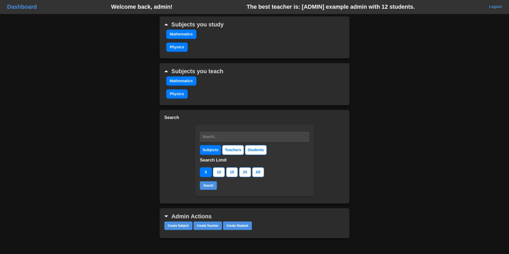

# universitySystem
A simple teacher/subject/student management system build during [BI-TJV, Java Technology] at CVUT FIT 2024/2025. 





## Backend 
Spring Security with JWT token authentication. 
Swagger for API docs. 

## Frontend 
Spring Web + Thymeleaf 
Plain-old html, css and js


# Running the thing
The app consists of a separate frontend and backend both written using Spring Boot. 
To run the app, you will need the following:
 - any JVM 
 - Gradle
 - Docker
 
In the folder "universityServer":
```
docker-compose up
```
In the folder  "universityClient":
```
./gradlew bootRun
```

The app will be available at the http://localhost:8082
API docs will be available at the http://localhost:8081/swagger-ui

## Basics 
I have decided on three roles: ADMIN, TEACHER and STUDENT. 
Based on that role, you have several privilages. 
For example, only the ADMINS can create entities. 
Only the ADMINS and TEACHERS can see all the students of the subject. 
For more info, please consult the swagger docs. 

### There are several pre-made accounts like the:
 - [username] -- [password]
 - admin -- admin 
 - student -- student
 - teacher-student -- teacher-student
